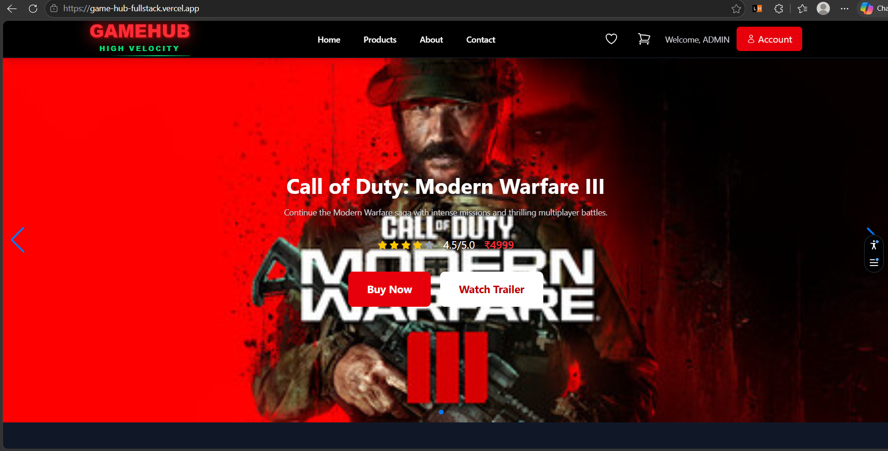
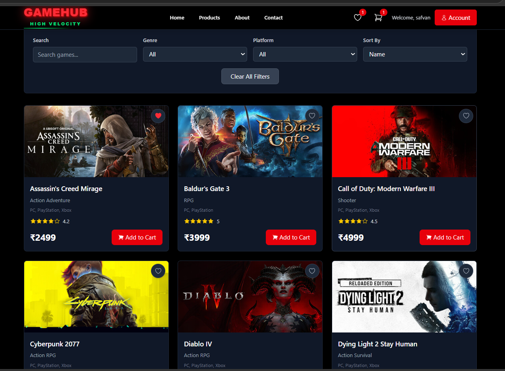
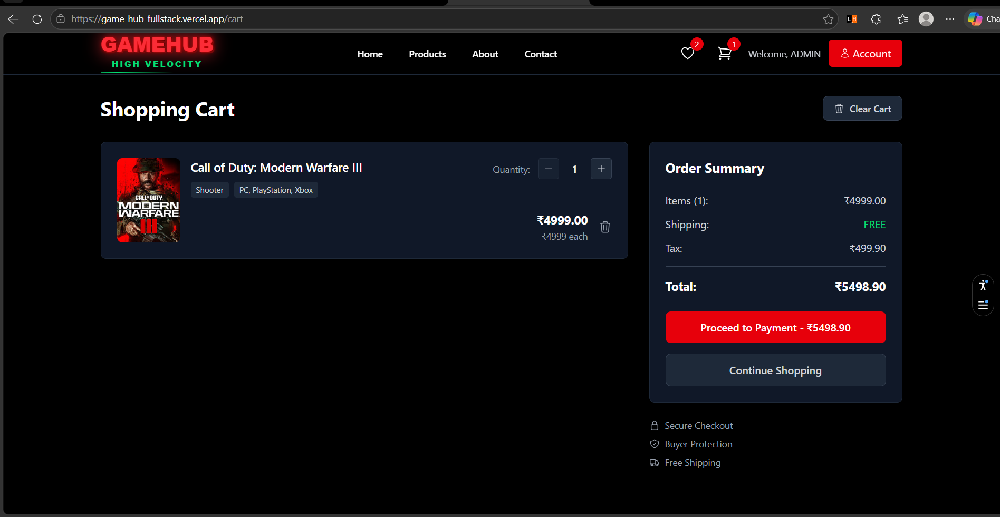
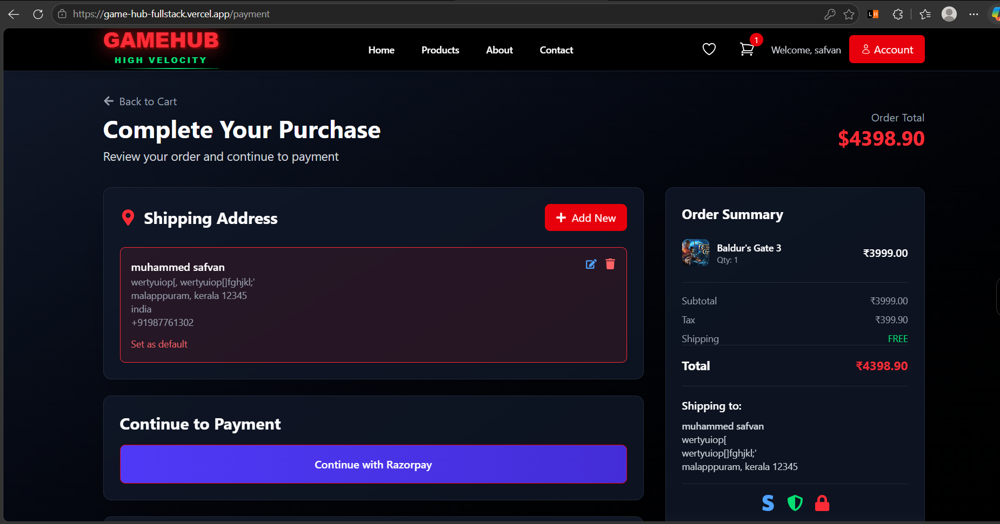
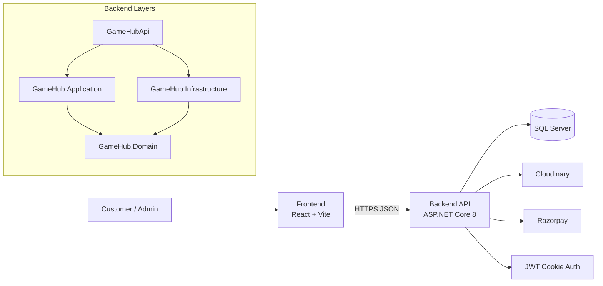
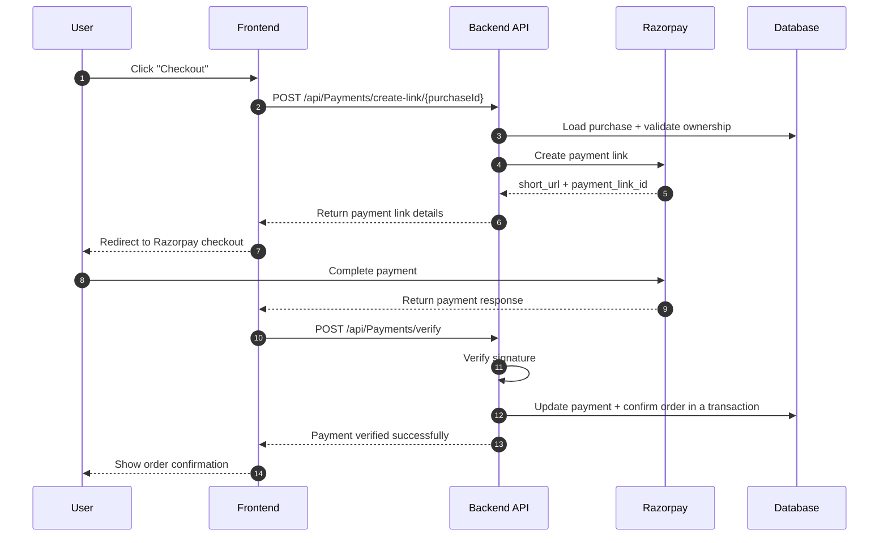

# GameHub

[](https://github.com/naheel0/GameHub-fullstack/actions)
[](https://github.com/naheel0/GameHub-fullstack/actions)
[](#license)
[](https://github.com/naheel0/GameHub-fullstack/stargazers)
[](./Frontend)
[](./GameHubApi)

> A polished full-stack e-commerce showcase for discovering games, managing carts, and completing secure payment-backed checkout flows.



## Table of Contents

1. [Project Overview](#project-overview)
2. [Why I Built This](#why-i-built-this)
3. [Live Demo & Credentials](#live-demo--credentials)
4. [Features](#features)
5. [Screenshots / GIFs](#screenshots--gifs)
6. [Tech Stack](#tech-stack)
7. [Architecture](#architecture)
8. [Checkout Flow](#checkout-flow)
9. [Getting Started](#getting-started)
10. [Environment Variables](#environment-variables)
11. [API Documentation](#api-documentation)
12. [Deployment](#deployment)
13. [Project Structure](#project-structure)
14. [Performance & Optimizations](#performance--optimizations)
15. [Key Challenges](#key-challenges)
16. [Future Improvements](#future-improvements)
17. [FAQ](#faq)
18. [Contributing](#contributing)
19. [Acknowledgments](#acknowledgments)
20. [Author & Contact](#author--contact)
21. [License](#license)

## Project Overview

**GameHub** is a full-stack e-commerce application focused on product browsing, cart management, checkout, user authentication, order handling, and payment verification. It is structured as a monorepo with a React frontend and a .NET 8 backend split into application, domain, infrastructure, and API layers.

The project is designed as a solo showcase piece: the goal is not just to make a store work, but to demonstrate the architectural decisions, security considerations, and UI polish that separate a demo from a production-minded product.

## Why I Built This

I built GameHub to practice the full lifecycle of a real commerce experience rather than a toy CRUD app. It gave me room to work through product search, cart consistency, authenticated workflows, secure payment handling, and deployment-aware configuration.

The project also reflects my learning goals as an engineer: keep the frontend responsive and intuitive, keep the backend maintainable and testable, and make the payment and order flow safe enough to trust.

## Live Demo & Credentials

If deployed, use the details below:

- Live demo: https://game-hub-fullstack.vercel.app
- API docs: https://localhost:7023/swagger
- Test user email: demo@gamehub.dev
- Test user password: Password123!


## Features

### User Experience

- Browse a curated game catalog with product detail pages.
- Add, update, and remove items from the cart.
- Save products to a wishlist for later.
- Manage shipping addresses for checkout.
- Complete checkout through Razorpay payment links.
- Review order history and order details.
- Use responsive layouts optimized for desktop and mobile.
- Get immediate feedback through polished UI states and motion.

### Admin Experience

- Access an admin dashboard for a quick business overview.
- Create, edit, and delete game listings.
- Review and manage orders.
- Manage user accounts, including blocking, activation, and role updates.
- Keep catalog data aligned without manual database edits.

### Technical Highlights

- JWT authentication with HTTP-only cookie support.
- Role-based authorization for protected admin routes.
- Razorpay payment integration with signature verification.
- Transactional checkout flow to keep order and payment state consistent.
- Entity Framework Core persistence with SQL Server.
- FluentValidation for request validation.
- Centralized exception handling and structured API errors.
- Swagger/OpenAPI documentation for the backend.
- Cloudinary-ready image management.
- CORS configured for local development and deployment environments.
- Clean layered architecture across application, domain, infrastructure, and API projects.

## Screenshots / GIFs

Add your own assets here to make the README feel real and product-focused.

### Cover


### Product Grid



### Cart



### Checkout



## Tech Stack

| Layer | Tech | Why I Chose It |
|---|---|---|
| Frontend | React 19 | Fast component model, strong ecosystem, and a great fit for a dynamic storefront. |
| Build Tool | Vite | Lightweight dev server and fast production builds. |
| Styling | Tailwind CSS | Rapid UI composition with consistent spacing and responsive design. |
| UI Enhancements | MUI, Framer Motion, Lucide, React Icons | Helps deliver a polished interface with motion, icons, and accessible components. |
| Routing | React Router | Clear client-side navigation for storefront and admin flows. |
| Backend | ASP.NET Core 8 | Strong performance, typed APIs, and excellent support for production services. |
| Data Access | Entity Framework Core | Clean database interaction and migration support. |
| Validation | FluentValidation | Keeps API contracts strict and expressive. |
| Database | SQL Server | Reliable relational storage for orders, users, carts, and payments. |
| Auth | JWT + HTTP-only cookies | Stateless auth with better XSS resistance than localStorage-based tokens. |
| Payments | Razorpay | Clean payment-link flow and signature verification for checkout security. |
| Media | Cloudinary | Makes product image handling simpler and more scalable. |
| API Docs | Swagger / OpenAPI | Fast discovery and testing for backend endpoints. |
| Deployment | Azure, Vercel | Recommended production and frontend hosting options. |

## Architecture



## Checkout Flow



## Getting Started

### Prerequisites

- Node.js 18+ and npm
- .NET SDK 8.0
- SQL Server or SQL Server LocalDB
- Razorpay test account
- Cloudinary account
- Git

### Clone the Repository

```bash
git clone https://github.com/naheel0/GameHub-fullstack.git
cd GameHub-fullstack
```

### Backend Setup

```bash
dotnet restore GameHubApi/GameHubApi.slnx
dotnet build GameHubApi/GameHubApi/GameHubApi.csproj -c Release
dotnet run --project GameHubApi/GameHubApi/GameHubApi.csproj
```

The API runs at `https://localhost:7023` or `http://localhost:5177` in development, and Swagger opens automatically.

### Frontend Setup

```bash
cd Frontend
npm install
npm run dev
```

The frontend runs at `http://localhost:5173`.

### Seed Data

The backend applies migrations on startup. If you add a seed script or seed project later, run it after restoring dependencies and before signing in with test accounts.

```bash
dotnet run --project GameHubApi/GameHubApi/GameHubApi.csproj
```

## Environment Variables

### Backend

| Variable | Example | Purpose |
|---|---|---|
| `ConnectionStrings__DefaultConnection` | `Server=(localdb)\\mssqllocaldb;Database=GameHubDb;Trusted_Connection=True;` | Main database connection string. |
| `JwtSettings__SecretKey` | `YourSuperSecretKeyHere_Minimum32Characters!` | Signs access and refresh tokens. |
| `JwtSettings__Issuer` | `GameHubApi` | JWT issuer validation. |
| `JwtSettings__Audience` | `GameHubReactApp` | JWT audience validation. |
| `JwtSettings__AccessTokenExpirationMinutes` | `15` | Access token lifespan. |
| `JwtSettings__RefreshTokenExpirationDays` | `7` | Refresh token lifespan. |
| `CloudinarySettings__CloudName` | `your-cloudinary-name` | Cloudinary media storage. |
| `CloudinarySettings__ApiKey` | `your-cloudinary-api-key` | Cloudinary authentication. |
| `CloudinarySettings__ApiSecret` | `your-cloudinary-api-secret` | Cloudinary authentication. |
| `Frontend__BaseUrl` | `http://localhost:5173` | Used for payment callbacks and redirects. |
| `Razorpay__KeyId` | `rzp_test_XXXXXXXXXXXXXX` | Razorpay public key ID. |
| `Razorpay__KeySecret` | `your-razorpay-key-secret` | Razorpay secret key for payment-link creation. |
| `AllowedOrigins` | `https://gamehub.naheel.me,https://game-hub-fullstack.vercel.app` | CORS allow-list. Set as `AllowedOrigins__0`, `AllowedOrigins__1`, … (array) or a comma-separated string. |
| `ASPNETCORE_ENVIRONMENT` | `Development` | Controls local developer behavior. |

### Frontend

| Variable | Example | Purpose |
|---|---|---|
| `API_BASE_URL` | `https://your-backend.azurewebsites.net` | Vercel env var. Read at build time by `vercel.ts` (API proxy) and exposed to the client via `define` in `vite.config.js`. No `VITE_` prefix — avoids Vercel's public-env warning. |
| `BACKEND_API_URL` | `https://localhost:7023` | Local dev only (`.env.local`). Target for the Vite dev-server proxy. |

> The frontend uses relative `/api` paths with a fallback when `API_BASE_URL` is unset. All API routing in production is server-side (Vercel rewrites) — no backend URLs are hardcoded in source.

### Local setup

1. Copy `Frontend/.env.example` to `Frontend/.env.local` and set `BACKEND_API_URL`.
2. Production: set `API_BASE_URL` in Vercel Project Settings → Environment Variables (Production + Preview).

## API Documentation

Full route reference: [docs/api.md](docs/api.md). Swagger at `https://localhost:7023/swagger` is the live interactive way to test the backend.

Base path: `/api`

### Products / Games

| Method | Endpoint | Auth | Description |
|---|---|---|---|
| `GET` | `/api/Games` | No | Returns the game catalog with paging/filtering support. |
| `GET` | `/api/Games/{id}` | No | Returns a single game by ID. |

### Auth

| Method | Endpoint | Auth | Description |
|---|---|---|---|
| `POST` | `/api/Auth/register` | No | Registers a new user. |
| `POST` | `/api/Auth/login` | No | Logs in and issues tokens. |
| `POST` | `/api/Auth/refresh` | No | Refreshes the access token. |
| `POST` | `/api/Auth/logout` | Yes | Revokes the current session. |
| `GET` | `/api/Auth/profile` | Yes | Returns the current user profile. |

### Cart

| Method | Endpoint | Auth | Description |
|---|---|---|---|
| `GET` | `/api/Cart` | Yes | Returns the authenticated user's cart. |
| `POST` | `/api/Cart` | Yes | Adds a product to the cart. |
| `PUT` | `/api/Cart/{gameId}` | Yes | Updates quantity for a cart item. |
| `DELETE` | `/api/Cart/{gameId}` | Yes | Removes a product from the cart. |
| `DELETE` | `/api/Cart` | Yes | Clears the cart. |

### Checkout / Orders / Payments

| Method | Endpoint | Auth | Description |
|---|---|---|---|
| `POST` | `/api/Orders` | Yes | Creates an order from the cart. |
| `POST` | `/api/Orders/buy-now` | Yes | Creates an order directly from a single product (Buy Now). |
| `GET` | `/api/Orders` | Yes | Returns the current user's order history. |
| `GET` | `/api/Orders/{orderId}` | Yes | Returns a single order. |
| `POST` | `/api/Payments/create-link/{purchaseId}` | Yes | Creates a Razorpay payment link. |
| `POST` | `/api/Payments/verify` | Yes | Verifies Razorpay payment signature. |
| `POST` | `/api/Payments/confirm-link` | Yes | Confirms a payment-link purchase. |
| `POST` | `/api/Payments/restore/{purchaseId}` | Yes | Restores items to the cart after a failed payment. |

### Admin

| Method | Endpoint | Auth | Description |
|---|---|---|---|
| `GET` | `/api/Admin/dashboard` | Admin | Returns admin KPIs and summaries. |
| `GET` | `/api/admin/games` | Admin | Manages the game catalog. |
| `GET` | `/api/admin/users` | Admin | Lists users. |
| `GET` | `/api/admin/orders` | Admin | Lists all orders. |


## Deployment

Recommended options for this project:

### Vercel (frontend)

Use Vercel for the frontend and set the `API_BASE_URL` environment variable (Project Settings → Environment Variables) to the deployed API origin — `vercel.ts` picks it up at build time.

```bash
vercel deploy
```

### Azure (backend)

A practical Azure setup is:

- Frontend on Azure Static Web Apps or Vercel.
- Backend on Azure App Service.
- Database on Azure SQL.
- Media on Cloudinary.

Before deploying, set the production values for `ConnectionStrings__DefaultConnection`, `JwtSettings__SecretKey`, `Frontend__BaseUrl`, `Razorpay__KeySecret`, and `AllowedOrigins`.

## Project Structure

```text
GameHub/
├─ Frontend/
│  ├─ src/
│  │  ├─ components/
│  │  ├─ contexts/
│  │  ├─ pages/
│  │  ├─ Services/
│  │  └─ styles/
│  ├─ vite.config.js
│  └─ package.json
└─ GameHubApi/
   ├─ GameHub.slnx
   ├─ GameHub.Application/
   ├─ GameHub.Domain/
   ├─ GameHub.Infrastructure/
   └─ GameHubApi/
      ├─ Controllers/
      ├─ Middleware/
      ├─ Models/
      ├─ Properties/
      └─ Program.cs
```

## Performance & Optimizations

- Code splitting and lazy loading keep the initial frontend bundle lean.
- Product images are optimized through Cloudinary instead of shipping large static assets.
- API responses are shaped for the UI instead of exposing unnecessary columns.
- CORS, auth, and environment-specific config keep local and production behavior consistent.
- Payment and order updates run inside transactions to prevent half-finished checkout states.
- Backend validation catches bad input early and avoids unnecessary database work.
- UI feedback patterns reduce repeated clicks and unnecessary duplicate submissions.

## Key Challenges

### Cart Race Conditions

A cart can easily become inconsistent if quantity updates, removals, and checkout happen at the same time. I addressed this by making cart and checkout operations server-driven and transaction-aware so the database remains the source of truth.

### Secure Payment Flow

Payment callbacks cannot be trusted blindly. The checkout flow verifies the Razorpay signature before marking an order as confirmed, which prevents forged success responses from updating order state.

### Deployment Configuration Drift

Frontend and backend environment variables are easy to misconfigure across local, preview, and production environments. I solved this by keeping callback URLs, CORS origins, JWT settings, and API base URLs explicit and environment-specific.

## Future Improvements

- Add real-time inventory locking or optimistic concurrency on stock rows.
- Introduce saved payment methods and a smoother repeat-checkout flow.
- Expand test coverage with more integration and E2E scenarios.
- Add search, filtering, and sorting refinements for larger catalogs.
- Add invoice downloads and richer order status timelines.
- Improve analytics for abandoned carts and conversion tracking.
- Add dark mode theming if the design system is extended further.

## FAQ

### Why did you choose JWT over server sessions?

JWT fits a split frontend/backend architecture well, especially when the frontend and API are deployed separately. HTTP-only cookies help keep tokens out of JavaScript access while still keeping the app stateless.

### How do you handle stock concurrency?

The current architecture keeps checkout and payment updates transactional. For higher traffic or stricter inventory guarantees, the next step would be optimistic concurrency tokens or atomic inventory updates at the database level.

### How is payment security handled?

Razorpay payment links are created on the server, and the success callback is not trusted on its own. The backend verifies the payment signature before confirming the order.

### Can I swap Razorpay for Stripe or PayPal?

Yes. The payment service is isolated enough that a different provider can be introduced behind the same application service contract.

## Contributing

This is a solo showcase project, but thoughtful improvements are welcome.

1. Open an issue describing the change or bug.
2. Keep changes focused and consistent with the existing architecture.
3. Include screenshots for UI changes and tests for behavior changes.
4. Avoid breaking the payment and order flows without discussing the impact first.

## Acknowledgments

- Razorpay documentation for the payment-link flow.
- Microsoft Learn for ASP.NET Core, EF Core, and authentication guidance.
- Tailwind CSS, Vite, React, Swashbuckle, FluentValidation, and Cloudinary for the underlying tooling.
- Design inspiration from modern commerce systems and product-led storefronts.

## Author & Contact

- GitHub: https://github.com/naheel0
- LinkedIn: https://www.linkedin.com/in/naheel-muhammad
- Portfolio: https://naheel.me

## License

This project is licensed under the MIT License. See the `LICENSE` file for details.
